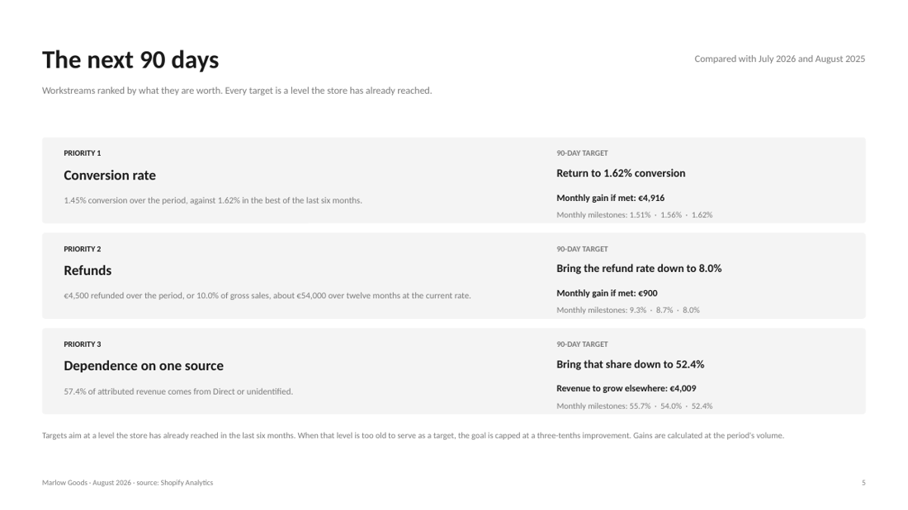
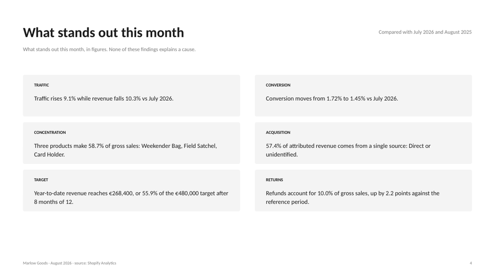

# Shopify monthly report

A Claude plugin that turns a Shopify store's data into a complete monthly
report: a PowerPoint deck in the store's own colours, ending with a 90-day plan
of measured targets.

It is built for the merchant, not the analyst. It picks the chapters that make
sense for that particular store, surfaces what stands out, and says what to
work on next, in figures anyone can check.

[Français](README.fr.md)



## What makes it different

**It adapts to the store.** Before collecting a single figure, it works out the
catalogue structure, the sales channels, the countries, whether there are
subscriptions or a point of sale, and whether customers come back. A store that
sells consumables gets its Customers chapter second; a store that sells durable
goods gets Acquisition second. A 15-product catalogue is detailed down to sizes
and colours; a 2,000-product catalogue is presented by product line.

**It prioritises without advising.** The plan ranks workstreams by what they are
worth in money, sets a target for each, and calculates the gain: "bringing the
refund rate from 10.0% to 8.0% recovers 900 per month at current volume". Every
target is a level the store has already reached in the last six months, so it
is reachable by construction.

**It never states a cause.** No slide says why a number moved, and none
prescribes a remedy. There is no industry benchmark anywhere: everything rests
on what a line costs, on the store measured against itself, and on thresholds
the merchant declared.

**It remembers.** The context and the plan are stored in a metafield on the
store itself. Next month's report opens on a follow-up slide comparing each
milestone to what was actually measured.

## Requirements

- The **Shopify connector** in Claude. That is the only hard dependency.
- Python 3.9+ with `python-pptx` and `Pillow`.

Email, analytics and advertising connectors are optional. When they are absent
the matching chapters simply do not appear, with no gap and no "not available".

## Install

Download the packaged plugin from
[Releases](https://github.com/agencecinq/shopify-monthly-report/releases) and
install it in the Claude desktop app, or clone the repository and point your
plugin directory at it.

```bash
git clone https://github.com/agencecinq/shopify-monthly-report.git
pip install python-pptx Pillow
```

## Use

Ask in one sentence:

- "Build me last month's report"
- "September figures as a deck"
- "A recap of the quarter for my co-founder"
- "What should I focus on?"

With no period given, the report covers the last complete calendar month.

The first time on a store, six questions are asked one at a time: who reads the
report, what the store sells, the revenue target for the year, whether cost of
goods is filled in, what return rate is considered acceptable, and which
channels to leave out. The answers live in the store's Shopify metafield, so
there is no file to keep. After that, one extra question per month, no more.

## What the report contains



Cover, table of contents, the month at a glance, what stands out, last month's
plan, the next 90 days, then the chapters: **Sales** (daily trend, 24-month
history, breakdown, channels), **Acquisition** (funnel, sources, countries and
devices), **Products** (best sellers, lines, variants, stock, returns),
**Customers**, **Profitability**, **Marketing**, and a method slide saying where
every figure comes from.

Each chapter carries one line explaining what the metric measures and how to
read it. Chapters with no data are not rendered.

## Languages

English and French ship with the plugin. Pass `--lang en`, `--lang fr`, or set
`meta.lang` in the report data.

Number and currency formatting follows the language, not just the words: French
writes `35 396 €` and English writes `€35,396`.

To add a language, copy `skills/shopify-monthly-report/i18n/en.json`, translate
the values, keep the keys, and adjust the `_format` block. Pull requests
welcome. Any key a translation is missing falls back to English rather than
printing a raw key into someone's deck.

## Try it without a Shopify store

The repository ships a complete example built on a fictional store:

```bash
cd skills/shopify-monthly-report/scripts
python3 build_report.py --data ../../../examples/report.example.json \
  --lang en -o report.pptx
```

That file is also the reference for the data contract, documented in
[`report-schema.md`](skills/shopify-monthly-report/references/report-schema.md).

## How it works

Claude collects the data and writes a `report.json`; three Python scripts turn
it into the deck. The split matters: everything that must be reproducible is in
the scripts, not in the model's output.

| File | Role |
|---|---|
| `scripts/brand.py` | Derives a readable palette from the Shopify theme, handling the three families of themes and fixing contrast |
| `scripts/highlights.py` | Computes the salience findings from numeric rules |
| `scripts/priorities.py` | Builds the 90-day plan: ranking, targets, milestones |
| `scripts/build_report.py` | Assembles the deck |
| `scripts/i18n.py` | Language and number formatting |

Findings and targets are computed, never written by the model. That is what
keeps them reproducible from one month to the next and from one store to
another, and what stops the report drifting into advice.

## Contributing

See [CONTRIBUTING.md](CONTRIBUTING.md). Translations, new salience rules and
support for other analytics sources are all welcome.

## Licence

MIT, see [LICENSE](LICENSE). Built by [CINQ - Agence Wordpress & Shopify](https://agencecinq.com).
